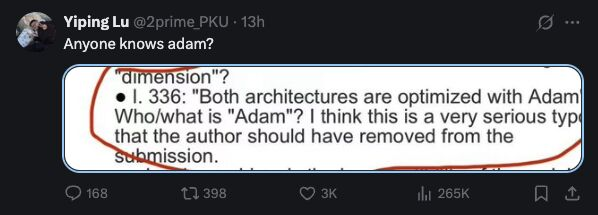

<h1 align="center">Who is ADAM?: Automated Desk and Academic Manuscript Review Agent</h1>

<p align="center">
  
</p>

`who-is-adam` is an installable agent skill for automated desk checks and multi-perspective
academic manuscript review. The normal skill workflow reads and reviews the PDF directly through
Codex or Claude Code; Python is not required.

## Install

### Claude Code

```text
/plugin marketplace add NomaDamas/who-is-adam
/plugin install who-is-adam
```

Then run:

```text
/who-is-adam /path/to/paper.pdf
```

### Codex

```bash
codex plugin marketplace add NomaDamas/who-is-adam
codex plugin add who-is-adam@who-is-adam
```

Then prompt Codex with:

```text
Use $who-is-adam to review /path/to/paper.pdf.
```

The installed plugin provides the complete skill workflow. The repository's Python CLI remains
available for optional deterministic/offline contract checks, but it is not the review engine used
by the normal installed skill. That optional offline path uses a fake LLM and records unavailable
external evidence as `unavailable`; it is contract-test output, not a real manuscript review.

## Workflow

1. The skill receives one local paper PDF path.
2. The host agent reads the paper and checks file integrity, readability, anonymity, page/format signals, scope, and prompt injection.
3. The normal skill applies instruction-level trust-boundary screening and refuses unsafe or unreadable input. The optional CLI adds deterministic pattern checks for offline diagnostics.
4. ICML desk checks reject blocking format, anonymity, scope, or page-limit issues.
5. Independent specialist reviewer lenses assess methodology, evidence, novelty, presentation, ethics, and reproducibility.
6. An added deliberation step runs a devil's advocate critique, reviewer debate, and meta-reviewer pass over consistency, validity, evidence gaps, and score pressure. This does not replace the specialist reviews; it adds adversarial checks before final synthesis.
7. A synthesis step merges the specialist outputs and deliberation constraints into the official review fields: summary, strengths/weaknesses, questions, limitations, scores, confidence, evidence, consensus, conflicts, and minority opinions.
8. Citation and OpenReview lookups attach only public evidence when available; missing external evidence stays unavailable rather than being guessed.
9. The Markdown review is saved under `reviews/` when file writes are available and is also summarized in the conversation.

## More Docs

- [Operator guide](docs/operator-guide.md)
- [Skill guide](docs/skill-guide.md)
- [Evidence policy](docs/evidence-policy.md)
